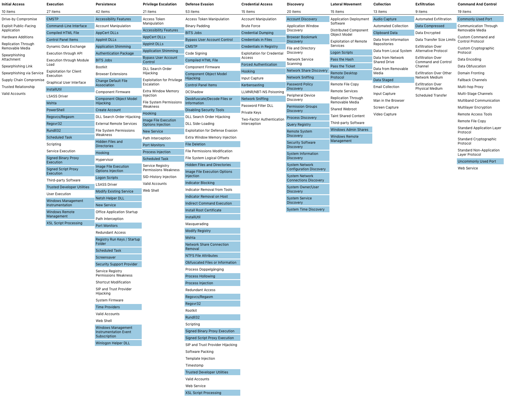

# ThreatHunting | A Splunk app mapped to MITRE ATT&CK to guide your threat hunts

This is a Splunk application containing several dashboards and over 120 reports that will facilitate initial hunting indicators to investigate.

You obviously need to be ingesting Sysmon data into Splunk, a good configuration can be found [here](https://github.com/olafhartong/sysmon-modular)

**Note:**
This application is not a magic bullet, it will require tuning and real investigative work to be truly effective in your environment.
Try to become best friends with your system administrators. They will be able to explain a lot of the initially discovered indicators.

Big credit goes out to [MITRE](https://attack.mitre.org) for creating the ATT&CK framework!

Pull requests / issue tickets and new additions will be greatly appreciated!

## Mitre ATT&CK

I strive to map all searches to the ATT&CK framework.
A current ATT&CK navigator export of all linked configurations is found [here](attack_matrix/threathunting.json) and can be viewed [here](https://mitre.github.io/attack-navigator/enterprise/#layerURL=https%3A%2F%2Fraw.githubusercontent.com%2Folafhartong%2Fthreathunting%2Fmaster%2Fattack_matrix%2Fthreathunting.json&scoring=false&clear_annotations=false)

### App Prerequisites

Install the following apps to your SearchHead:

- [Punchcard Visualization](https://splunkbase.splunk.com/app/3129/)
- [Force Directed Visualization](https://splunkbase.splunk.com/app/3767/)
- [Sankey Diagram Visualization](https://splunkbase.splunk.com/app/3112/)
- [Lookup File Editor](https://splunkbase.splunk.com/app/1724/)

## Required actions after deployment

- Make sure the threathunting index is present on your indexers
- Edit the macro's to suit your environment > https://YOURSPLUNK/en-US/manager/ThreatHunting/admin/macros
- The app is shipped without whitelist lookup files, you'll need to create them yourself. This is so you won't accidentally overwrite them on an upgrade of the app.
- Install the lookup csv's or create them yourself, empty csv's are [here](https://github.com/olafhartong/ThreatHunting/raw/master/files/ThreatHunting.tar.gz)

A step by step guide kindly written by Kirtar Oza can be found [here](https://www.linkedin.com/pulse/attckized-splunk-kirtar-oza-cissp-cisa-ms-/)

## Usage

A more detailed explanation of all functions can be found [here](https://github.com/olafhartong/ThreatHunting/wiki)
or in [this blog post](https://medium.com/@olafhartong/endpoint-detection-superpowers-on-the-cheap-threat-hunting-app-a92213f5e4b8)
